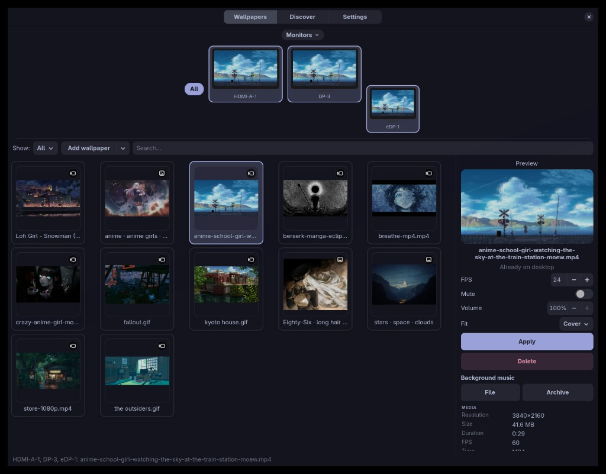
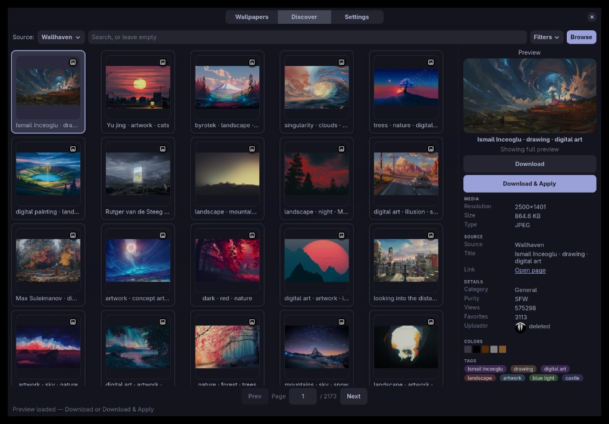
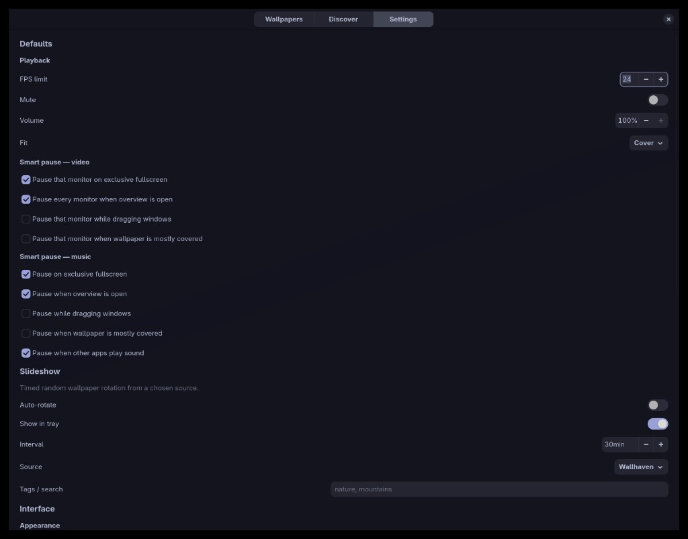

# nwall

**Live video and image wallpapers for [niri](https://github.com/YaLTeR/niri) — without the cursor stutter.**

    

---

nwall is a wallpaper daemon and picker for the [niri](https://github.com/YaLTeR/niri) Wayland compositor. It plays images and video as your desktop background, ships a GTK4 gallery for browsing your library, can pull wallpapers from online sources, and attaches per-wallpaper background music. A small CLI drives the same daemon, so everything is scriptable. It is niri-first by design.

## Why it exists

A video player on a layer-shell surface plays back fine on its own, but the desktop starts to stutter as soon as you move the mouse or drag a window. The compositor re-imports a full-size video frame every refresh, the hardware cursor loses its fast path, and everything skips. niri's Overview makes that worse unless playback pauses.

nwall fixes that path instead of working around it:

- ffmpeg decode is paced to the target FPS and scaled to the display size before it ever reaches the compositor
- frames are presented through `wl_shm` + `wp_viewporter` on an opaque surface with no input region
- the daemon waits on frame callbacks rather than flooding niri with commits
- a `nwall-live` layer-shell surface does the animation
- playback smart-pauses on fullscreen, Overview, window drag, and when the wallpaper is fully covered

## Screenshots



*Wallpapers — local library, per-monitor apply, live preview*



*Discover — online sources with filters and previews*



*Settings — playback, smart pause, slideshow, library, sources*

## Features

**Wallpapers**

- Images (`jpg`, `png`, `webp`, `bmp`) and video (`mp4`, `webm`, `mkv`, `avi`, `mov`, `m4v`, `gif`)
- Per-monitor apply, or all monitors at once
- `cover` / `contain` / `stretch` fit modes
- FPS cap, or `0` to freeze a video as a still image
- Smart pause on fullscreen, Overview, window drag, and covered surfaces
- Slideshow rotation from your local library or any configured source

**Discover**

- Wallhaven, Bing Daily, NASA APOD, Internet Archive, and curated GitHub wallpaper packs out of the box
- Pixabay and Coverr once you add a free API key
- Your own GitHub folders or catalog JSON as extra sources
- Add from YouTube via `yt-dlp` into your library

**Audio**

- Per-wallpaper looping background music, stored in a sidecar next to the media file
- Sources: a local audio file, Internet Archive, or YouTube Music (`yt-dlp`)
- Independent volume, mute, and pause rules for wallpaper audio and background music
- Optional pause when something else on the system is playing audio

**Interface and control**

- GTK4 / libadwaita picker with live preview
- System tray via StatusNotifier: pause, slideshow, music mute, open picker, quit
- `system` / `dark` / `light` themes plus optional custom CSS
- Full CLI over a Unix socket, and a reusable IPC crate if you want to write your own client

## Requirements

- [niri](https://github.com/YaLTeR/niri) with layer-shell and `wp_viewporter`
- Rust toolchain (`cargo`)
- `ffmpeg` and `ffprobe` on `PATH`
- GTK4 and libadwaita — only if you build the GUI
- A StatusNotifier host — only if you enable the tray
- `yt-dlp` — "Add from YouTube" and YouTube Music background tracks

## Installation

```bash
git clone https://github.com/LukasSor/nwall
cd nwall
./scripts/install.sh
```

The installer is the recommended path. It builds the workspace, installs binaries into `~/.local/bin`, and merges niri layer rules into `~/.config/niri/config.kdl` inside a managed block that is safe to re-run.

If `~/.local/bin` is not already in your shell PATH, add it with this command:

```bash
export PATH="$HOME/.local/bin:$PATH"
```

Running it with no flags opens an interactive menu that asks:

- install / update, or uninstall
- full install (GUI + CLI + daemon) or CLI + daemon only
- build the daemon with the system tray
- install the `.desktop` launcher entry
- install and enable the systemd user service
- merge the niri layer rules
- which folder to use as your wallpaper library

For scripted setups, every prompt has a flag:


| Flag             | Effect                                            |
| ---------------- | ------------------------------------------------- |
| `--yes`, `-y`    | Accept defaults, no prompts                       |
| `--no-gui`       | CLI + daemon only                                 |
| `--no-tray`      | Build the daemon without the system tray          |
| `--no-desktop`   | Skip the `.desktop` launcher entry                |
| `--no-systemd`   | Skip the systemd user unit                        |
| `--no-niri`      | Do not touch your niri config                     |
| `--library DIR`  | Wallpaper library folder                          |
| `--uninstall`    | Remove installed files                            |
| `--purge-config` | With `--uninstall`, also remove `~/.config/nwall` |


```bash
./scripts/install.sh --yes --library ~/Pictures/Wallpapers   # unattended
./scripts/install.sh --no-gui --no-tray                      # headless / CLI only
./scripts/install.sh --uninstall --purge-config              # remove everything
```

**Manual install**

```bash
cargo build --release -p nwall -p nwalld -p nwall-gui

install -Dm755 target/release/nwalld    ~/.local/bin/nwalld
install -Dm755 target/release/nwall     ~/.local/bin/nwall
install -Dm755 target/release/nwall-gui ~/.local/bin/nwall-gui

install -Dm644 docs/nwalld.service ~/.config/systemd/user/nwalld.service
systemctl --user daemon-reload
systemctl --user enable --now nwalld.service
```

Then merge [docs/niri-layer-rules.kdl](docs/niri-layer-rules.kdl) into `~/.config/niri/config.kdl`:

- `nwall-live` uses `place-within-backdrop true` so the wallpaper sits in the workspace backdrop (not behind chrome)
- `layout { background-color "transparent" }` so the wallpaper shows through

Skip the GUI crate if you only want the daemon and CLI.

## Configuration

Copy [config/example.toml](config/example.toml) to `~/.config/nwall/config.toml` — the installer does this for you if the file is missing.

- Library folder defaults to `~/Pictures/Wallpapers`
- Optional GUI stylesheet at `~/.config/nwall/theme.css`
- The daemon listens on `$XDG_RUNTIME_DIR/nwall.sock`
- `nwall reload` pushes config changes into the running daemon

Wallhaven works without a key for SFW results; sketchy and NSFW need a key from [wallhaven.cc](https://wallhaven.cc/settings/account). Pixabay and Coverr only appear in Discover once you add their free API keys in Settings.

## CLI

`nwall` talks to the running daemon over the Unix socket. It covers everything local: wallpapers, video playback, background music, smart pause, and the slideshow. Online Discover browsing stays in the GUI.

**Daemon**

```bash
nwall daemon          # start nwalld in the background if it is not running
nwall ping            # check the daemon is reachable
nwall status          # full state as JSON
nwall gui             # open the picker
nwall reload          # re-read ~/.config/nwall/config.toml
nwall quit
```

**Wallpaper and video**

```bash
nwall set ~/Videos/loop.mp4
nwall set ~/Pictures/wall.png -o DP-3 -o HDMI-A-1   # repeatable; default is all outputs
nwall fit cover                                     # cover | contain | stretch
nwall fps 24                                        # 0 freezes to a still, no decoder
nwall volume 40                                     # 0-100 or 0.0-1.0, also unmutes
nwall mute
nwall mute --off
nwall pause
nwall resume
```

**Smart pause**

```bash
nwall pause-policy                                  # print current policy
nwall pause-policy --fullscreen true --overview true --window-drag true --covered true
nwall pause-policy --music-fullscreen true --music-overview true --music-on-other-audio true
```

**Background music**

Music is attached per wallpaper and stored in a `*.nwall.json` sidecar next to the media file. When that wallpaper is applied, the daemon loops the track. Every subcommand takes `-w/--wallpaper` to target a wallpaper other than the current one.

```bash
nwall music set ~/Music/ambient.mp3
nwall music volume 40
nwall music mute
nwall music mute --off
nwall music pause
nwall music resume
nwall music clear
```

**Slideshow**

```bash
nwall slideshow show
nwall slideshow set --source library --interval 30 --tags nature
nwall slideshow set --no-tray                       # hide slideshow controls in the tray
nwall slideshow start
nwall slideshow stop
```

`--source` is either `library` or the name of a source from your config. `--tags` feeds the search for online sources and matches filenames for the local library.

Every command is a thin wrapper around the protocol in `nwall-ipc`, so you can build another client against the same socket.

## Adding your own sources

Discover can read from a **GitHub folder** or a **catalog JSON** over HTTPS. Add either in Settings → Wallpaper sources by pasting a `github.com/owner/repo[/path]` or `https://…/catalog.json` link, or declare them under `[[sources]]` in `config.toml`.

### GitHub repos

nwall lists the **direct children** of a single folder — it does not walk nested subfolders. Put media files flat in that path, or at the repo root if `path` is empty.

Supported extensions are `jpg`, `jpeg`, `png`, `webp`, `bmp` for images and `mp4`, `webm`, `mkv`, `avi`, `mov`, `m4v`, `gif` for video. Git LFS works. A personal access token (`api_key`, or `GITHUB_TOKEN` / `GH_TOKEN` in the environment) is optional for public repos but raises the 60 requests/hour unauthenticated limit.

```toml
[[sources]]
name = "my-walls"
kind = "github"
repo = "someone/wallpapers"
path = "images"          # optional folder; omit or "" for the repo root

# Or merge several folders into one Discover source:
# repos = [
#   { repo = "someone/wallpapers", path = "images" },
#   { repo = "someone/wallpapers", path = "videos" },
# ]
```

### Catalog JSON

Host a JSON file over HTTPS. It can be `{ "items": [ … ] }` or a bare `[ … ]` array. A working file is at [config/catalog.example.json](config/catalog.example.json).

Each item:


| Field   | Required | Notes                                                            |
| ------- | -------- | ---------------------------------------------------------------- |
| `url`   | yes      | Direct download URL for the media file                           |
| `name`  | no       | Display title; defaults to the file name                         |
| `kind`  | no       | `"image"` or `"video"`; otherwise guessed from the URL extension |
| `thumb` | no       | Thumbnail URL, worth setting for videos                          |


```json
{
  "name": "Example video pack",
  "items": [
    {
      "name": "Seaside",
      "kind": "video",
      "url": "https://example.com/seaside.mp4",
      "thumb": "https://example.com/seaside.jpg"
    },
    {
      "name": "Forest still",
      "kind": "image",
      "url": "https://example.com/forest.jpg"
    }
  ]
}
```

```toml
[[sources]]
name = "my-pack"
kind = "index"
url = "https://example.com/catalog.json"
```

## Architecture


| Crate           | Role                                                                 |
| --------------- | -------------------------------------------------------------------- |
| `nwalld`        | One `nwall-live` layer-shell surface: decode, present, niri smart-pause, optional tray |
| `nwall`         | CLI client, depends only on `nwall-ipc`                              |
| `nwall-gui`     | GTK4 picker, Discover, settings                                      |
| `nwall-ipc`     | Config types and the Unix-socket protocol                            |
| `nwall-catalog` | Online sources, downloads, sidecars — shared by the GUI and daemon   |


The GUI and daemon never link against each other. They only talk over the socket.

## Contributing

Issues and pull requests are welcome, especially niri edge cases, GUI polish, and new wallpaper packs. If you have an idea for a feature, please open an issue and describe it — that is genuinely useful.

## AI notice

Large parts of nwall were written with AI coding assistants / tools under human direction for architecture, review, and performance work. Treat the code like any other project: read it, question it, and send fixes when it is wrong.

AI-assisted contributions are welcome as long as they are treated with care — read, reviewed, tested, and owned by whoever submits them.

## License

[MIT](LICENSE)